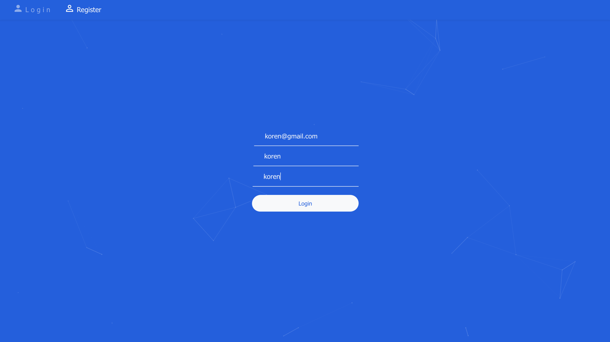

# UserAuthentication



### MongoDB Docker
```bash
docker run -d -p 27017:27017 --name mongo mongo:3.2
```

### Run Server
```bash
npm install
npm start
```

### Run Client

```bash
cd client
npm install
npm start 
```